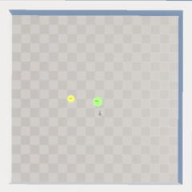
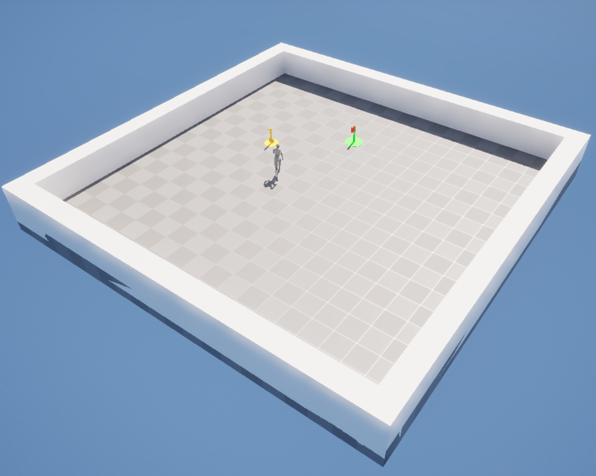
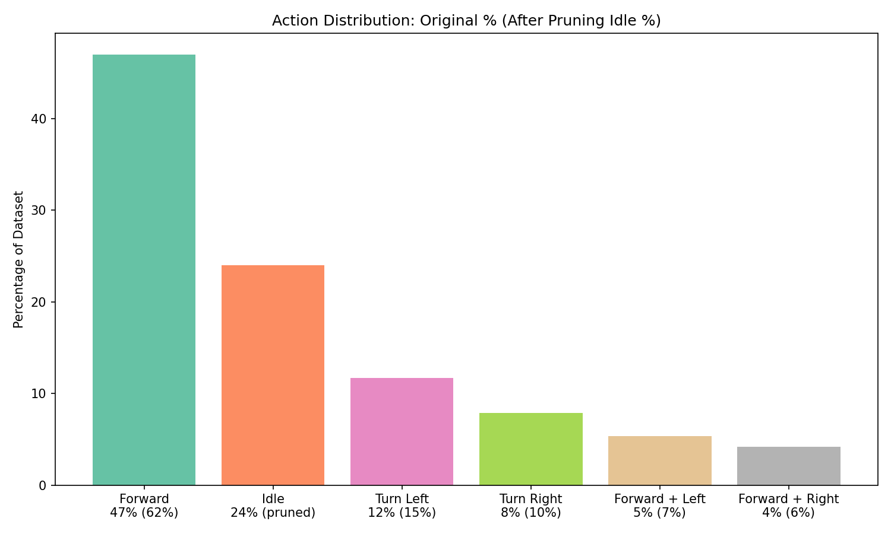

# Behaviour Cloning with AMD Schola: Learning from Human Demonstrations

## By: Tian Yue Liu

## Tags: AI, Developers, AI/ML, Gaming, ROCm, Reinforcement Learning, Unreal Engine

<div>
    
</div>

Behaviour cloning (BC) is a powerful technique for training AI agents by learning directly from human demonstrations. Rather than designing reward functions and waiting for an agent to discover good behaviours through trial and error, BC allows you to show the agent exactly what you want it to do—and it learns to imitate.

AMD Schola v2 introduces a streamlined workflow for collecting human demonstrations in the [Minari](https://minari.farama.org/) dataset format, enabling you to train behaviour cloning models using any compatible library and deploy them directly in Unreal Engine.

> **Prerequisites:** This guide assumes familiarity with Unreal Engine (Blueprints or C++) and basic machine learning concepts (training, inference, neural networks).

## Why Behaviour Cloning?

Reinforcement learning is powerful, but it comes with challenges:

- **Reward design is hard** - Crafting reward functions that lead to desired behaviour can be challenging. Agents often find unexpected exploits or fail to learn nuanced behaviours.
- **Training takes time** - RL agents need millions of environment interactions to learn complex tasks.
- **Some behaviours are easier to show than describe** - For tasks like natural movement, combat tactics, or puzzle-solving, it's often easier to demonstrate the desired behaviour than to specify it mathematically.

Behaviour cloning addresses these challenges by learning directly from examples. A human plays the game, and the agent learns to mimic those decisions.

## The Workflow

Schola's BC pipeline consists of four steps:

1. **Setup** - Configure the imitation environment in Unreal Engine
2. **Collect** - Play your game while Schola records your observations and actions to a Minari dataset
3. **Train** - Use any Minari-compatible library to train a neural network policy
4. **Deploy** - Export the trained model to ONNX and run it in Unreal Engine

The following sections walk through each step using our example environment. To make things concrete, we'll use a simple navigation task that demonstrates all the key concepts.

## Example Environment: UnlockDoor

This guide uses a simple "UnlockDoor" environment where the agent must obtain a key and then reach the goal location (the door).



**Observations** (Box spaces):

- **Relative directions** - 6 normalized float values representing the relative X/Y directions and distances to the key and goal
- **Key captured flag** - A binary value indicating whether the agent has picked up the key

**Actions** (Multi-Discrete):

- **Branch 1 (Movement)** - Size 2: move forward or do nothing
- **Branch 2 (Turning)** - Size 3: turn left, turn right, or do nothing

This environment is simple enough to learn from a small number of demonstrations while still requiring the agent to understand spatial relationships and sequencing (get key first, then go to door).

## Step 1: Setting Up the Imitation Environment

Before collecting demonstrations, configure the imitation learning environment in Unreal Engine. All actors and components mentioned are part of the Schola plugin.

### Imitation Connection Manager

Add an **Imitation Connection Manager** actor to your level where you specify the connection port. This component manages the gRPC connection between Unreal Engine and the Python training scripts, handling the communication of observations, actions, and episode boundaries during demonstration collection.

### Single Agent Imitation Environment

For this example, we implement the [`ISingleAgentImitationScholaEnvironment`](https://gpuopen.com/manuals/schola/guides/migrating_to_v2/#imitation-learning) interface. This interface defines the contract for single-agent imitation learning environments:

| Method                  | Description                                                                             |
| ----------------------- | --------------------------------------------------------------------------------------- |
| `InitializeEnvironment` | Define the agent's observation and action spaces                                        |
| `SeedEnvironment`       | Set the random seed for reproducible behaviour                                          |
| `SetEnvironmentOptions` | Configure environment-specific options                                                  |
| `Reset`                 | Reset the environment and return the initial state                                      |
| `Step`                  | Execute one step and return the imitation state (observations, expert actions, rewards) |

Schola provides `AImitationPlayerController`, a Blueprint-extendable PlayerController that implements this interface. To use it:

1. Create a Blueprint subclass of `AImitationPlayerController`
2. Override the interface methods to define observation/action spaces and implement environment behaviour
3. Optionally set the `InputMappingContext` property if using the Enhanced Input helpers

The base class provides `BuildActionSpaceFromIMC()` and `PollActionsFromIMC()` helper functions to automatically extract action spaces from an Input Mapping Context and poll current input values—useful for capturing continuous actions directly from player input.

For this example, we customized the controls using Unreal key press events to produce discrete actions that map cleanly to the multi-discrete action space. This approach provides more control over how human inputs translate to the action representation expected by the BC model.

## Step 2: Collecting Demonstration Data

Schola uses [Minari](https://minari.farama.org/) as its dataset format for storing demonstration trajectories. Minari is a widely adopted format for offline RL and imitation learning datasets, providing efficient HDF5 storage, versioning, and metadata management.

### Recording Demonstrations

To collect demonstrations, run the following command:

```bash
schola minari collect executable --executable-path <PATH_TO_EXECUTABLE> --dataset-id my-demo-v0
```

This connects your imitation environment to Python, and as you play, Schola records:

- **Observations** - What the agent sees (sensor data, game state, etc.)
- **Actions** - The inputs you provide (movement, turning, etc.)
- **Rewards** - The reward signal at each step

> **Note:** Minari dataset names must end with a version suffix (e.g., `-v0`, `-v1`). This is a Minari requirement for dataset management and versioning.

The `minari collect` command supports several options for controlling the recording session:

```bash
schola minari collect executable --executable-path <PATH_TO_EXECUTABLE> \
    --dataset-id my-demo-v0 \
    --num-steps 10000 \
    --fps 30
```

- `--num-steps`: Total environment steps to record into the dataset (Schola steps the collector once per step until this count is reached)
- `--fps`: Fixed simulation timestep for the standalone executable (optional)

### Inspecting Your Dataset

After collecting data, inspect your dataset to understand its contents and quality:

```python
import minari

# List all local datasets
print(minari.list_local_datasets())

# Load and inspect a dataset
dataset = minari.load_dataset("my-demo-v0")
print(f"Total episodes: {dataset.total_episodes}")
print(f"Total steps: {dataset.total_steps}")
print(f"Observation space: {dataset.observation_space}")
print(f"Action space: {dataset.action_space}")

# Iterate through episodes to examine the data
for episode in dataset.iterate_episodes():
    print(f"Episode length: {len(episode.actions)}")
    print(f"Actions shape: {episode.actions.shape}")
    print(f"Total reward: {sum(episode.rewards)}")
    break  # Just show the first episode
```

This helps you verify that your demonstrations were recorded correctly and gives you insight into the data distribution.

### Improving Dataset Quality

The quality of your demonstrations directly impacts the quality of the learned policy. Here are techniques to improve your dataset:

#### Pruning Idle Steps

Human demonstration data often contains "idle" steps—moments where you haven't yet responded to a state change, resulting in zero or no-op actions. These uninformative transitions can confuse the model.

With minari datasets, we can analyze how many idle steps the dataset contains using:

```python
import minari
import numpy as np

dataset = minari.load_dataset("my-demo-v0")

# Count idle steps
total_steps = 0
idle_steps = 0
for episode in dataset.iterate_episodes():
    idle_mask = np.all(episode.actions == 0, axis=-1)
    total_steps += len(episode.actions)
    idle_steps += np.sum(idle_mask)

print(f"Idle steps: {idle_steps}/{total_steps} ({100*idle_steps/total_steps:.1f}%)")
```

In our UnlockDoor demonstrations, **24% of steps were idle** (12,000 out of 50,000). Removing these reduces our dataset to 38,000 actionable steps.

#### Balancing Action Distribution

After pruning idle steps, analyze the remaining action distribution:

```python
from collections import Counter

action_counts = Counter()
for episode in dataset.iterate_episodes():
    for action in episode.actions:
        if not np.all(action == 0):  # Skip idle
            action_counts[tuple(action.flatten())] += 1

for action, count in action_counts.most_common():
    print(f"  {action}: {count}")
```



The chart shows each action's original percentage, with the percentage after pruning idle steps in brackets. After pruning, "Forward" increases from 47% to **62%** of all actions, while turning actions account for only 10-15% each. This imbalance can cause the BC model to underlearn rare but critical turning behaviours—the agent might learn to always walk forward and never turn.

To address this, compute sampling weights inversely proportional to action frequency:

```python
# Compute balanced sampling weights
total_actions = sum(action_counts.values())
num_classes = len(action_counts)
target_freq = 1.0 / num_classes  # Equal frequency for all actions

weights = {}
for action, count in action_counts.items():
    actual_freq = count / total_actions
    weights[action] = target_freq / actual_freq

print("Sampling weights:")
for action, weight in sorted(weights.items(), key=lambda x: -x[1]):
    print(f"  {action}: {weight:.2f}x")
```

Use these weights when sampling training batches to ensure the model sees each action type equally often. In our experiments, balancing the action distribution improved the model's ability to perform turning manoeuvres.

## Step 3: Training the BC Model

Once you have collected and preprocessed your demonstration data, you can train a behaviour cloning model using any library that supports the Minari dataset format.

Popular options include:

- [imitation](https://imitation.readthedocs.io/) - A library for imitation learning algorithms including BC, DAgger, and GAIL
- [d3rlpy](https://d3rlpy.readthedocs.io/) - An offline deep reinforcement learning library
- Custom PyTorch/TensorFlow implementations

### Example: Training with imitation

Here's a minimal example using the [imitation](https://imitation.readthedocs.io/) library:

```python
import minari
import numpy as np
from imitation.algorithms.bc import BC
from imitation.data.types import Transitions

# Load dataset
dataset = minari.load_dataset("my-demo-v0")

# Convert to Transitions format
all_obs, all_acts, all_next_obs, all_dones = [], [], [], []
for episode in dataset.iterate_episodes():
    all_obs.append(episode.observations[:-1])
    all_next_obs.append(episode.observations[1:])
    all_acts.append(episode.actions)
    dones = np.zeros(len(episode.actions), dtype=bool)
    dones[-1] = episode.terminations[-1] or episode.truncations[-1]
    all_dones.append(dones)

transitions = Transitions(
    obs=np.concatenate(all_obs),
    acts=np.concatenate(all_acts),
    next_obs=np.concatenate(all_next_obs),
    dones=np.concatenate(all_dones),
    infos=np.array([{}] * sum(len(a) for a in all_acts)),
)

# Train
bc_trainer = BC(
    observation_space=dataset.observation_space,
    action_space=dataset.action_space,
    demonstrations=transitions,
)
bc_trainer.train(n_epochs=100)
```

### Exporting to ONNX

After training, export your model to ONNX for deployment in Unreal Engine:

```python
import torch

# Get the trained policy
policy = bc_trainer.policy
policy.set_training_mode(False)

# Create dummy input
obs_shape = dataset.observation_space.shape
dummy_obs = torch.zeros(1, *obs_shape, dtype=torch.float32)

# Export
torch.onnx.export(
    policy,
    dummy_obs,
    "bc_model.onnx",
    input_names=["obs"],
    output_names=["action"],
    dynamic_axes={"obs": {0: "batch"}, "action": {0: "batch"}},
    opset_version=17,
)
```

## Step 4: Deploying to Unreal Engine

The ONNX model is compatible with Unreal Engine's Neural Network Engine (NNE). Schola's inference system consists of three main components:

1. **Agent** - Any object implementing the `IAgent` interface that defines observation and action spaces
2. **Policy** - A `UNNEPolicy` that loads your trained ONNX model and performs inference
3. **Stepper** - A `USimpleStepper` that coordinates the observation-inference-action loop

To deploy your trained agent:

1. **Import the ONNX model** - Drag and drop the `.onnx` file into the Content Browser to create an ONNX model data asset
2. **Implement the IAgent interface** - Create a class that implements `Define()`, `Observe()`, `Act()`, and `GetStatus()`/`SetStatus()` methods
3. **Create and configure the Policy** - Set the `Model Data` property to your ONNX asset and choose a runtime (e.g., "NNERuntimeORTCpu" or "NNERuntimeORTDml")
4. **Create and initialize the Stepper** - Call `Init()` with your agent(s) and policy, then call `Step()` each frame to run inference

The agent will now make decisions using the behaviour-cloned policy, mimicking the demonstrations provided.

For detailed instructions, see the [Setting Up Inference](https://gpuopen.com/manuals/schola/guides/setting_up_inference/) guide.

## Results

This workflow demonstrates how Schola enables collecting human gameplay data and using it to bootstrap agent training. In our testing with the UnlockDoor environment, a BC model trained on 107 demonstration episodes (38,000 steps after pruning) learned the general structure of the task:

- Navigate toward the key
- Pick up the key
- Navigate toward the door

The BC-trained agent isn't perfect—it occasionally gets stuck or takes suboptimal paths. The value is that the agent already understands the task structure, providing a meaningful starting point over a random policy.

## Next Steps

### Continue Training with RL

A BC-trained policy provides an excellent initialization for reinforcement learning. Instead of spending millions of steps learning basic task structure from scratch, the RL algorithm can focus on refining an already-competent policy—fixing the edge cases where the BC model gets stuck. This "warm start" approach often leads to faster convergence and better final performance.

### Collect More Targeted Demonstrations

If the BC model struggles with specific scenarios, collect additional demonstrations focusing on those situations. Minari makes it easy to combine multiple datasets using `minari.combine_datasets()`.

## Conclusion

AMD Schola v2's behaviour cloning workflow demonstrates how human gameplay can be captured, stored, and used to bootstrap agent training. By combining Minari's standardized dataset format with your choice of training library and Unreal Engine's NNE inference, the pipeline enables rapid iteration from gameplay to deployed AI agents.

Whether you're prototyping NPC behaviours, bootstrapping RL training, or creating AI that mimics specific playstyles, behaviour cloning provides an efficient starting point—turning your gameplay examples into functional agents that can be refined further with reinforcement learning.

---

_Schola is developed by AMD and released as part of the GPUOpen initiative. For more information about AMD's open-source tools and libraries, visit [gpuopen.com](https://gpuopen.com/)._
