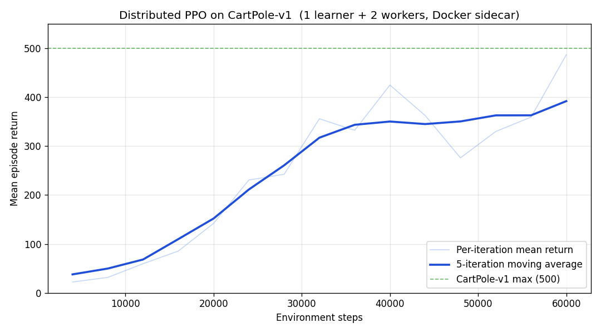

# Distributed Reinforcement Learning with AMD Schola, Ray, and Kubernetes

## By: Tian Yue Liu

## Tags: AI, Developers, AI/ML, Gaming, Reinforcement Learning, Unreal Engine, Kubernetes, Distributed Computing

Training intelligent agents in Unreal Engine is compute-intensive: a single environment instance can only generate so much experience per second, and learning algorithms need large batches to make stable progress. The natural solution is to run many environments in parallel — and with Schola's new distributed training support, you can now scale across machines using [Ray](https://www.ray.io/) and Kubernetes.

## Why Distributed Training?

In a single-machine setup, Schola runs one or more Unreal Engine instances as child processes, all communicating with a Python training script over localhost. That works well for prototyping, but hits limits when:

- **You need more environments than one machine can run.** Game environments often consume several CPU cores and gigabytes of RAM each.
- **You want to separate learning from simulation.** GPU gradient computation and CPU-bound environment stepping compete for the same resources.
- **You need reproducible, scalable infrastructure.** Manual process management doesn't scale to dozens of workers across a cluster.

Schola v2.x addresses all three with first-class support for **Ray RLlib distributed training** and a deployment model designed for **Kubernetes**.

## What's New

**`ExternalSimulator`.** The `UnrealEditor` simulator has been renamed to `ExternalSimulator` to better reflect its role: it assumes the UE instance is already running externally and performs no process lifecycle management while `UnrealEditor` remains as a backwards-compatible alias, making pod lifecycles managed by the orchestrator instead of training script.

**Insecure gRPC mode.** `credential_mode="insecure"` on `GrpcProtocol` uses a plain TCP channel instead of a local Unix socket, which is required when the UE instance is in a different pod or on a different machine.

**URL templates for per-worker routing.** The `url` field in `protocol_args` supports `{worker_index}` placeholders (e.g. `"ue-{worker_index}"`). `ScholaEnvRunner` expands the template on each worker using its `EnvContext.worker_index`, so worker 1 connects to `ue-1`, worker 2 to `ue-2`, etc. All configuration flows through the serialized `env_config` — no hidden environment variable reads.

**Dedicated learner topology.** The training configuration supports `num_learners=X` and `num_env_runners=Y`, allowing you to scale learning and data collection independently. Ray custom resources (`ue_worker` / `ue_sidecar`) pin environment runners to nodes with UE servers, giving clean resource isolation:

| Node Type | Count | Role                                  | Resources                |
| --------- | ----- | ------------------------------------- | ------------------------ |
| Head      | 1     | Orchestration and space discovery     | 0 CPUs (driver only)     |
| Learner   | X     | Gradient computation, weight updates  | 2 CPUs (or GPU) each     |
| Worker    | Y     | ScholaEnvRunner, environment stepping | 1 CPU + UE instance each |

## How It Works

The distributed training flow has four phases:

1. **Space discovery** — the head node connects to a single UE instance to read the observation and action spaces, then closes the connection.
2. **Cluster connection** — the driver calls `ray.init(address="auto")` to join the Ray cluster; workers and learners have already registered via `ray start`.
3. **Job submission** — the PPO config is built with _serializable_ `env_config` (class references + kwargs, not live objects). Ray ships this to every remote actor.
4. **Training loop** — each `ScholaEnvRunner` reconstructs its own `GrpcProtocol` and `ExternalSimulator`, connects to its assigned UE instance, and collects experience. Learners receive batched data, compute gradients, and broadcast updated weights back.

## Deployment Patterns

### Sidecar: UE in the Same Pod

The simplest approach runs UE as a sidecar container alongside the Ray worker. The env runner connects to `localhost:50051` — no network configuration needed.

```
Pod (worker-0)
├── Container: ray-worker  →  ScholaEnvRunner on localhost:50051
└── Container: ue-instance →  gRPC server on port 50051
```

Simple networking, low latency; UE and Ray share pod resources.

### Networked: UE in Separate Pods

For more flexibility, UE runs in its own pod. The env runner connects over the cluster network using a Kubernetes Service name.

```
Pod (worker-1)                    Pod (ue-1)
└── ray-worker  ───────────────►  └── ue-instance
    url="ue-{worker_index}" → ue-1    gRPC :50051
```

Independent scaling of UE and Ray resources; adds a small network hop. Both patterns support mounting UE executables from a shared volume to avoid image rebuilds.

## A Concrete Example: CartPole

To keep the setup reproducible on any developer laptop, the Schola repository ships with a Docker Compose simulation of both topologies, using `CartPole-v1` behind a mock gRPC server. This example is purely for illustration — in production the mock server is replaced with a real Unreal Engine instance serving your own environment — but it exercises the full distributed pipeline end-to-end without a packaged UE build or a Kubernetes cluster.

CartPole-v1 gives `+1` per timestep the pole stays balanced, up to a max return of `500`. "Solved" is usually `475`+.

### Running the Simulation

From the repository root:

```bash
# 1. Build the images (Ray 2.x + Schola + gym, CPU-only PyTorch)
docker compose -f docker/cluster-config.yml build

# 2. Run distributed training: 1 head + 1 learner + 2 workers
TRAIN_TIMESTEPS=60000 docker compose -f docker/cluster-config.yml \
    up --abort-on-container-exit

# 3. (Optional) parse the logs and plot a learning curve
docker compose -f docker/cluster-config.yml logs ray-head > training_run.log
python plot_training_curve.py training_run.log training_curve.png
```

The networked variant (`docker/cluster-config-networked.yml`) runs UE in its own containers and volume-mounts the training scripts from the host.

### Scaling Learners and Workers

Both topologies scale independently with a single command:

```bash
# 2 learners, 2 workers (sidecar)
NUM_LEARNERS=2 TRAIN_TIMESTEPS=60000 \
  docker compose -f docker/cluster-config.yml \
    up --scale learner=2 --abort-on-container-exit

# 3 learners, 2 workers (networked)
NUM_LEARNERS=3 docker compose -f docker/cluster-config-networked.yml \
  up --scale learner=3
```

In a real cluster, scale workers by deploying more UE pods and Ray worker pods and bumping `NUM_WORKERS`; scale learners by adding learner pods and bumping `NUM_LEARNERS`. The head node never changes.

### Results

With the default configuration (1 learner + 2 workers, `train_batch_size=4000`, PPO with default hyperparameters), PPO solves CartPole in **about 90 seconds** on a single laptop. Mean return climbs smoothly from ~22 (near-random) to **486** — above the `475` "solved" threshold — by iteration 15 (60k environment steps). Total wall-clock time: **~89 seconds** for 60k steps across 2 workers, 1 dedicated learner, and 1 head, all in Docker containers on a single machine.



The same code, with no changes, runs on a multi-node KubeRay cluster by swapping the Compose file for a `RayCluster` manifest and naming UE Kubernetes Services to match the `{worker_index}` URL template.

## What Schola Provides

- `ExternalSimulator` — no-op simulator for externally managed UE processes
- `GrpcProtocol` with `credential_mode="insecure"` — network-ready gRPC client
- `ScholaEnvRunner` — RLlib-compatible env runner with `{worker_index}` URL templates for per-worker routing
- `schola rllib train ppo external` in the CLI
- Docker Compose simulations for local end-to-end testing
- A full [distributed training guide](https://gpuopen.com/manuals/schola/schola-index/) in the documentation

You supply the Kubernetes cluster (with [KubeRay](https://docs.ray.io/en/latest/cluster/kubernetes/index.html) installed), a packaged UE executable with Schola enabled, Docker images, and the Kubernetes manifests for your environment.

## Getting Started

1. **Install Schola** with RLlib support — see the [setup guide](https://gpuopen.com/manuals/schola/schola-index/) for platform-specific instructions.
2. **Run the Docker Compose simulations** from the repository root (`docker compose up`, with the supporting Dockerfile under `docker/cluster-sim/`) to understand the distributed flow end-to-end on your local machine.
3. **Adapt the Compose topology to Kubernetes** — replace the Docker services with KubeRay `RayCluster` manifests and swap mock UE servers for your packaged Unreal Engine executable.

Full step-by-step details, including resource placement, scaling, and CLI usage, are in the [Schola documentation](https://gpuopen.com/manuals/schola/schola-index/) under **Guides → Distributed Training with Ray and Kubernetes**.

---

_Schola is developed by AMD and released as part of the GPUOpen initiative. For more information about AMD's open-source tools and libraries, visit [gpuopen.com](https://gpuopen.com/)._
