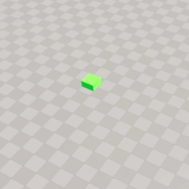

# Hierarchical RL with StateTree in AMD Schola: Training Smarter Game AI

## By: Tian Yue Liu

## Tags: AI, Developers, AI/ML, Gaming, ROCm, Reinforcement Learning, Unreal Engine

## Introduction

Building believable game AI often requires agents that can reason at multiple levels — choosing _what_ to do and figuring out _how_ to do it. A patrol guard, for example, must decide whether to investigate a noise or continue its route (a high-level choice) and then navigate smoothly to the chosen destination (a low-level skill). Tackling both with a single flat reinforcement learning (RL) policy leads to bloated action spaces and slow, brittle training.

Hierarchical reinforcement learning (HRL) addresses this by decomposing the problem: one agent selects goals while specialized sub-agents execute them. The challenge has been wiring this hierarchy into a game engine in a way that is practical for both researchers and game designers.

[AMD Schola](https://gpuopen.com/amd-schola/) now integrates directly with Unreal Engine's [StateTree](https://dev.epicgames.com/documentation/unreal-engine/state-tree-in-unreal-engine) system to solve exactly this. By embedding learnable RL policies as StateTree evaluators and tasks, Schola gives designers and researchers stateful control over branching decisions, observation/action binding, and hierarchical decomposition — all within Unreal's familiar visual workflow. The approach preserves the benefits of HRL while leveraging StateTree's evaluators, data binding, and deterministic transition semantics, as discussed in our paper ([arXiv:2510.14154](https://arxiv.org/abs/2510.14154)).

In this post, we walk through how the integration works, build a simple hierarchical agent step by step, and show how to train and deploy it.



## The Challenge: Complex AI Behaviors

Consider training an agent that needs to:

- **Decide** high-level strategy
- **Execute** actions with learned low-level control
- **Adapt** when conditions change

Training a single flat RL agent to handle both decision-making and execution can be difficult. The action space becomes unwieldy, and the agent struggles to learn both high-level strategy and low-level control simultaneously.

**Hierarchical RL** solves this by separating concerns:

1. A **high-level agent** selects goals
2. **Low-level agents** execute the selected behavior optimally

Each agent has a focused task, making training faster and more stable.

## Enter StateTree

[StateTree](https://dev.epicgames.com/documentation/unreal-engine/state-tree-in-unreal-engine) is Unreal Engine's modern state machine system, designed for complex AI. Unlike Behavior Trees, StateTree excels at:

- **Hierarchical structure** — natural parent/child state relationships
- **Evaluators** — continuous decision evaluation
- **Data binding** — type-safe property binding between nodes
- **Flexible transitions** — data-driven state changes

StateTree already models the structure hierarchical RL needs. Schola's integration adds RL-powered decision making directly into this framework.

## How It Works

Schola extends StateTree with three node types:

### 1. StateTreeEvaluator_RLDecision

This evaluator makes RL-driven branch selection decisions. It observes the game state and outputs a `SelectedBranch` that drives StateTree transitions.

The evaluator has these key properties:

- **Policy** — The ONNX model used for inference (instanced, editable)
- **NumBranches** — Number of possible branch choices (e.g., 2 for forward/backward)
- **SelectedBranch** — Output bound to conditions for transitions
- **Confidence** — The probability the agent assigned to the chosen branch

### 2. StateTreeTask_StepInference

This task node turns any StateTree state into an RL agent. Define observation/action spaces, collect observations, execute actions, and compute rewards—all within the familiar StateTree workflow.

### 3. StateTreeCondition_RLBranch

A simple condition that checks whether `SelectedBranch == BranchIndex`. Wire your StateTree transitions to the evaluator's output, and the RL agent controls the flow.

## A Simple Example: Hierarchical Direction Selector

Let's walk through a basic hierarchical agent that learns to select forward or backward movement based on a flag:

```
StateTree Root
│
├── [Evaluator] DirectionSelector (RL agent: selects direction)
│   └── Observes: current flag value (0 or 1)
│   └── Actions: 0=Forward, 1=Backward
│
├── → Forward State [RLBranch == 0]
│      └── [Task] MoveForwardTask (RL agent: controls speed)
│
└── → Backward State [RLBranch == 1]
       └── [Task] MoveBackwardTask (RL agent: controls speed)
```

**The learning objective:**

- The evaluator learns _when_ to select forward vs backward based on the flag
- Each task learns _how_ to move optimally in that direction
- Simple, focused rewards for each agent

**During training:**

- The **evaluator** receives +1 when the agent reaches target location matching the flag (x-position exceeds 500 for true, drops below -500 for false), and -1 for mismatch, with a -0.1 step penalty to encourage speed.
- The **forward task** receives +1 when the agent's x-position exceeds 500, with a -0.1 step penalty to encourage speed.
- The **backward task** receives +1 when the agent's x-position drops below -500, with the same -0.1 step penalty.

**During inference:**

- Export trained policies to ONNX
- Assign each policy to its node's **Policy** property
- The StateTree runs autonomously with learned behaviors

## Setting Up the Environment

Create a `StateTreeTrainingEnvironment` actor to manage the training loop:

1. Create a Blueprint extending `StateTreeTrainingEnvironment`
2. Set the **StateTree Asset** reference
3. Override **IsEpisodeOver** to define when episodes terminate
4. Override **OnEpisodeReset** to reset the flag and agent position

```cpp
void AMyTrainingEnv::IsEpisodeOver_Implementation(bool& OutTerminated, bool& OutTruncated)
{
    OutTerminated = StepCount >= MaxSteps;
    OutTruncated = false;
}

void AMyTrainingEnv::OnEpisodeReset_Implementation()
{
    // Randomize the flag for the next episode
    bCurrentFlag = FMath::RandBool();
    ResetAgentPosition();
}
```

## Agent IDs

Agent IDs are automatically derived from node names:

- **Evaluators**: Use the evaluator node name (e.g., "BranchSelector" → "branchselector")
- **Tasks**: Use the STATE name containing the task (e.g., "Forward" → "forward")

All IDs are normalized to lowercase. Each agent must have a unique name—duplicate names raise an error.

## Training Workflow

In this guide, we train StateTree agents exclusively with RLlib. Hierarchical RL maps naturally onto RLlib's multi-agent API — each evaluator and task in the StateTree becomes a separate agent with its own policy. Use the Schola CLI to launch training; here is an example command from our experiments:

```bash
schola rllib train ppo external \
  --port 8002 \
  --save-final-policy \
  --export-onnx \
  --fcnet-hiddens 16 16 \
  --timesteps 100000
```

Argument explanations:

- `--port 8002`: Port used by the Schola environment protocol (env ↔ trainer); change to avoid conflicts when running multiple workers or services.
- `editor`: Simulator subcommand; use `executable` or `project` instead when you launch Unreal from a packaged binary or want Schola to build and run the project (see the Schola CLI guide).
- `--save-final-policy`: Persist the final learned policy to the checkpoint directory after training completes.
- `--export-onnx`: Export the saved policy to an ONNX file for deployment into Unreal's StateTree nodes.
- `--fcnet-hiddens 16 16`: Defines the policy/value network as two fully-connected hidden layers with 16 units each (small, fast-to-train baseline).
- `--timesteps 100000`: Total environment timesteps to train for (adjust based on task complexity).

Notes on HRL / multi-agent usage:

- Each StateTree `Evaluator` or `Task` becomes its own agent ID (e.g., `directionselector`, `forward`).
- Use RLlib's multi-agent policy specification or a `policy_mapping_fn` to assign policies to agent IDs when you need different policies per role.
- Schola auto-discovers agents in the StateTree and exposes them to RLlib. You can tune per-policy network settings and checkpoint/export behavior via CLI flags or a config file.

## Results

In our experiments, the trained policies converged to deterministic behavior for this simple task. The branch-selector evaluator learned to always choose `0` (forward) when the flag is true and `1` (backward) when the flag is false. Correspondingly, the `forward` task policy consistently outputs action `1`, and the `backward` task policy consistently outputs action `-1`.

This confirms that the hierarchical decomposition works as intended: the high-level evaluator learns the correct branching strategy, and each low-level task learns its own focused motor skill — without interference between the two levels.

## Why StateTree for Hierarchical RL?

We chose StateTree integration because:

1. **Visual editing** — Design behavior hierarchies in UE's StateTree editor
2. **Mixed automation** — Combine RL decisions with scripted behaviors
3. **Game engine integration** — Access animations, navigation, physics naturally
4. **Familiar workflow** — StateTree is already used for complex UE AI
5. **Debugging** — Use UE's StateTree debugger to visualize agent decisions

## Getting Started

1. Enable the **ScholaStateTree** module in your project
2. Create a StateTree asset with your behavior hierarchy
3. Add `StateTreeEvaluator_RLDecision` for learnable branch selection
4. Add `StateTreeTask_StepInference` tasks for learnable behaviors
5. Add `StateTreeTrainingEnvironment` to your level
6. Train with `schola rllib train` (for example `schola rllib train ppo editor …`; see the command above)
7. Deploy trained ONNX models to your StateTree nodes

See our [complete guide](https://gpuopen.com/amd-schola/) for detailed setup instructions.

---

_StateTree integration is available in Schola v2.1+ and requires Unreal Engine 5.5 or later._
